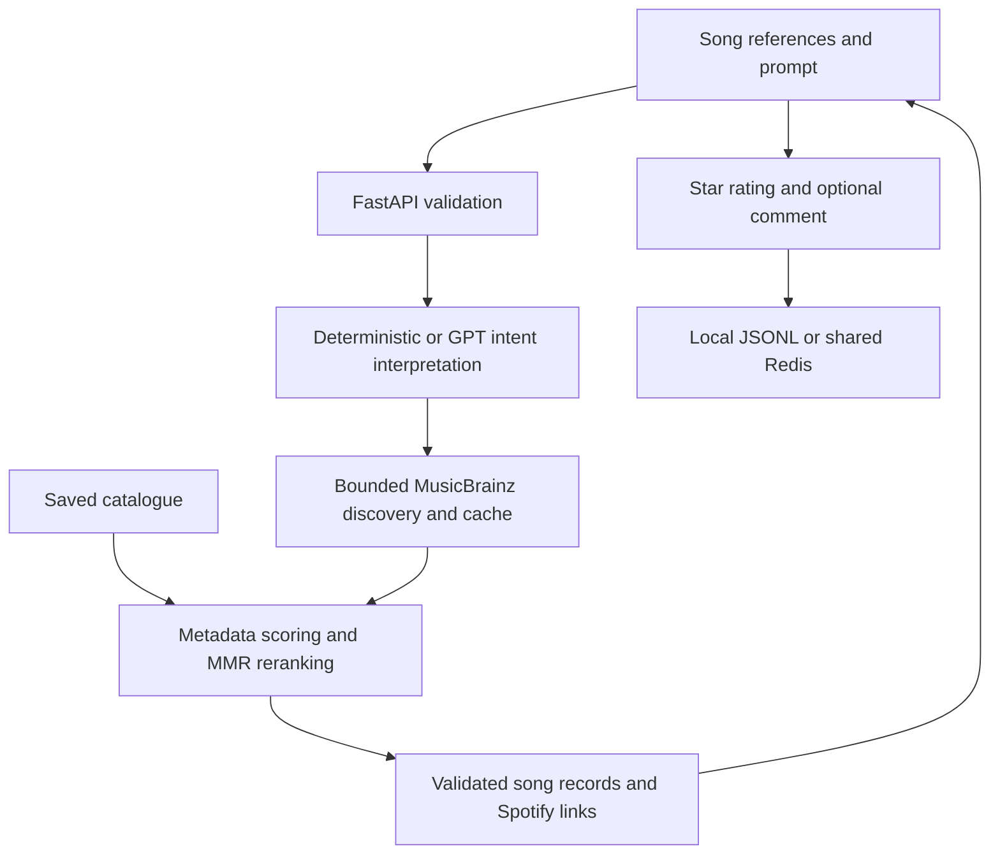

# Architecture

## Input and interpretation

The API accepts 0–50 unique seeds, an optional prompt up to 500 characters and a requested output
limit of 1–10. At least one seed or a non-blank prompt is required. Simple seeded requests use the
deterministic parser. Complex seeded requests use hybrid interpretation; prompt-only requests use
GPT. OpenAI Responses API output is validated against the supported preference vocabulary. GPT
produces musical constraints, not recommendations or arbitrary song IDs.

## Discovery and ranking

For applicable prompted requests, MusicBrainz supplies at most 100 recording candidates in one
bounded call after interpretation. The same style/year rules apply to online and saved candidates.
Genre alternatives use OR; acoustic/instrumental descriptors add AND requirements. Current fixed
recency rules are 2020 onward for recent and 2010 or earlier for classic.

Identity normalisation merges compatible source records, preserves aliases and excludes seed
recordings. Metadata similarity combines with a maximum marginal relevance (MMR) selection step
that balances relevance and diversity, including credited-artist constraints. Candidate indexes
are scoped to a request, avoiding mutation of the shared catalogue.

Unknown language, mood and energy remain unknown. Community labels, source annotations and audio
estimates have distinct provenance. Metadata cannot establish listening enjoyment, precise BPM,
complete instrumentation or an energy progression.

## External services and storage

- MusicBrainz: shared 1.1-second request gate, 10-second timeout, one online attempt, Retry-After
  cooldown. Query freshness is one day; public recording metadata is retained for 30 days.
- Local discovery cache: SQLite. Hosted discovery, Spotify states/sessions and feedback: Redis.
- During upstream failure the service uses retained cache/saved data. No qualifying fallback
  during an outage yields 503; a genuine no-match request yields 422.
- Spotify: optional PKCE sign-in, single-use OAuth state, opaque HttpOnly session cookies and
  server-side tokens. Listening links resolve a known track or fall back to Spotify search.
- Ratings: one star score and optional comment, stored locally as JSONL or in Redis. They are
  evaluation records and do not automatically retrain the recommender.

Seed autocomplete searches saved data. Online retrieval expands prompted recommendations only.

## Source map

| Module | Responsibility |
| --- | --- |
| `prototype/app/main.py`, `models.py` | HTTP contract, validation and routes |
| `router.py`, `ai_provider.py`, `service.py` | Interpretation routing and orchestration |
| `catalog.py`, `catalog_quality.py`, `metadata.py` | Catalogue identity and evidence |
| `recommender.py` | Scoring, filtering and diverse selection |
| `musicbrainz.py`, `discovery_store.py` | Bounded discovery and persistent cache |
| `spotify.py`, `oauth_store.py` | Login, sessions and listening links |
| `feedback_store.py`, `redis_rest.py` | Durable storage |
| `prototype/web/` | Composer, compact result rows and star-rating interface |
